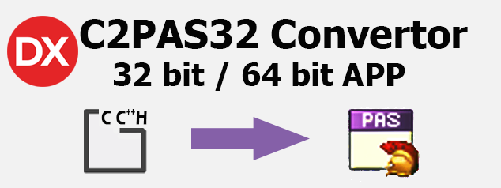
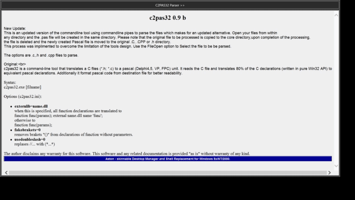
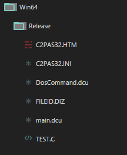
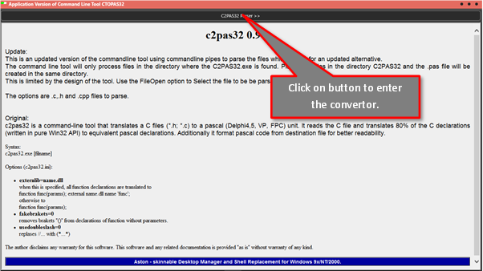
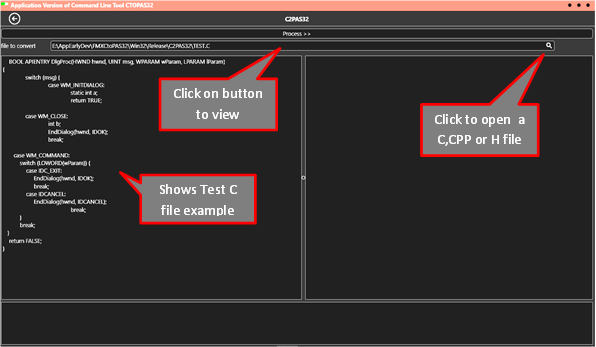
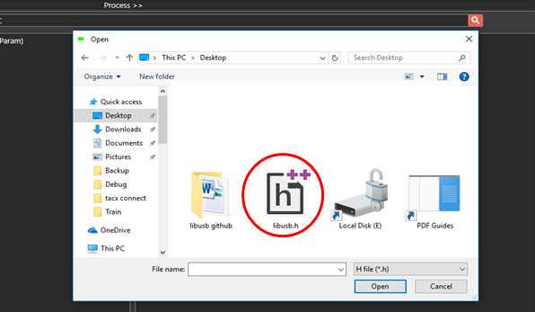
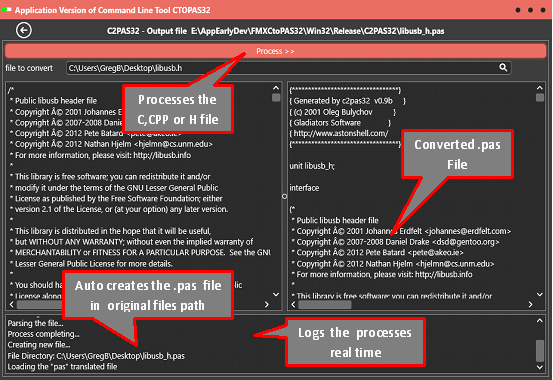
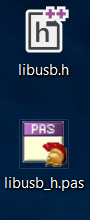

This is a wrapper Application of the original freely command line Application
made available by **ASTON** Software. The original application and its rights
are retained.

The original application is a CMD process and converting one file is easy
enough, but converting multiple files can become cumbersome.

This original C2PAS32 was reworked into an Application that can be compiled as a
Win32 or Win64 or set up as a standalone 32 bit or 64bit Windows Application.
The original exe remains intact.

**How it Works**

Your C, CPP, H files can be set up in your project area. To convert, the file is
opened and upon conversion, a .pas file is created and placed next to the
original file. The conversion process is quick and files can be rapidly
converted. It is designed to do all the work in the background. So when the
original file is opened, it immediately copies the original file to the
Application exe’s folder where the C2pas32.exe resides. The file is converted
and the. Pas file is created in the same directory. Thereafter, the file is
seamlessly moved to the original directory.

The convertor remains a convertor and not an IDE to rework the scripts. The
views are merely for the user to see that the correct file has been converted
and the processes thereof.

**Some Tips**

The converted .pas file can be opened in a Delphi IDE and debugged / manually
converted.

**A simple trick!** The original C, CPP, H file can be directly opened in the
Delphi IDE and action VIEW \\ NEW EDIT WINDOW which will place the C,CPP,H File
in a separate window view . Move the windows around so both can be viewed at the
same time whilst completing the final manual translation.

**How to Load in Windows 7, 10**

The exe requires the separate folder c2PAS32 to make it work. The C2PAS32.exe
requires the converted file to be in the same folder and will output to the same
folder.

So with file transfers, Windows will not allow this and the app cannot be placed
in the normal windows file structure. Without elevated privileges set in the
manifest.

I don’t advice this as windows has set this structure for a reason. The best
place to place the app exe is C:\\users\\your user name\\ App
Data\\Roaming\\CtoPAS32\\CTOD32APP.exe or in the documents folder.

**The Application**

The application uses standard controls but uses the freely available Dos Command
component (TDosCommand) that can be easily installed through the GETTIT manager.
This component is used to process the C232pas file.

**Using the Application**

The Application opens with an offline information html page.

Next Step:-

Open a File

Options C, CPP , H files.

Process the file…

No need to save the file as it auto creates file next to the original file.

**Conversion Efficiency**

Refer to the Shootout [www.bayeseanbog.com](http://www.bayeseanbog.com) where
this C232PAS was found to be the best convertor. This formed the basis for the
creation of this Application.

It will convert 80% of the data of which a total of 60% of the data will not
require much manual intervention.

There is no available open source convertor that will translate code 100%
efficiently. Even the paid versions do not advertise 100% conversion. So it is
best to read up on C/C++ if you have no knowledge of the language before
tackling the conversion as it will become a steep learning curve.

This will reduce the time to full conversion.

**Licence**

This is a free to use MIT licence.

Happy Converting
